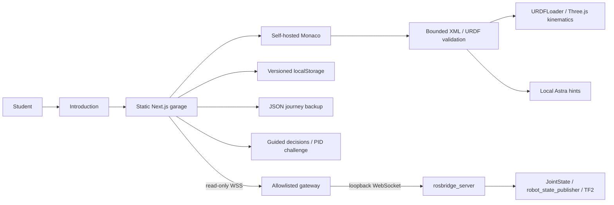
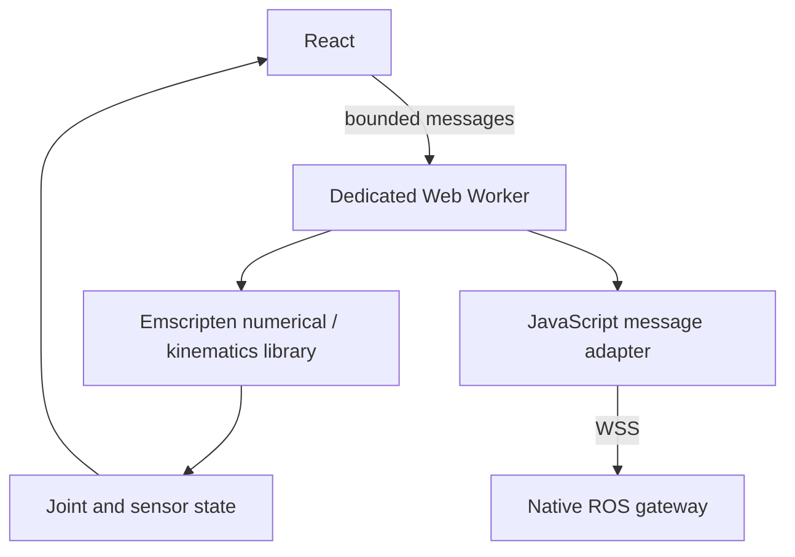

# Architecture and Engineering Boundaries

## Runtime



The build-time rendered page is a stable shell. Browser modules own WebGL, Monaco
and local storage. Three.js uses ROS's Z-up convention; URDFLoader handles joint
transforms and limits. No custom physics/IK implementation is presented as
equivalent to a complete robotics framework.

Frame axes in the viewer come from URDFLoader, not received TF2 messages. ROSLIB
receives `/joint_states`; native `tf_probe.py` independently demonstrates genuine
TF2 buffer lookups. The gateway also allows `/tf` and `/tf_static` for future
diagnostic views, but the current UI does not consume them.

## Quest lifecycle

1. Restore snippets and completed IDs from versioned local storage.
2. Edit source without rebuilding the scene on every keystroke.
3. Build checks syntax, uniqueness, topology, axes/limits, geometry, required frames
   and the tool transform. Invalid structure preserves the last renderable model;
   valid-but-wrong kinematics can be shown for diagnosis.
4. Award `urdf-tf2` once. XP derives from completed IDs, not a mutable counter.
5. Four decisions per phase unlock the next phase. Mechanics requires the URDF
   build; control requires the PID challenge. Completion is not certification.
6. Astra revalidates current source rather than trusting stale console results.

Progress is self-reported learning state, not an anti-cheat ledger. Add authoritative
server grading before using XP for credentials, competitive rankings or rewards.
Backups are explicit JSON snapshots; a confirmed restore replaces local data.
Unknown milestone IDs are discarded. No account, network sync or database exists.

## Curriculum coverage

| Phase       | Concepts                                                                                                                                              | Implemented learning surface                         |
| ----------- | ----------------------------------------------------------------------------------------------------------------------------------------------------- | ---------------------------------------------------- |
| Mechanics   | Requirements, mass budgets, center of mass, support polygon, torque, FreeCAD/SolidWorks exports, inertia, URDF/XACRO, forward kinematics              | Live URDF lab, briefings, checkpoint                 |
| Electronics | Protected rails, fuses, e-stop, logic levels, ESP32/STM32, H-bridges, encoders, I2C/SPI/UART/CAN, KiCad ERC/DRC/BOM/Gerbers                           | Design exercises and checkpoint                      |
| Control     | PID, sampling, saturation, anti-windup, derivative, differential-drive equations, encoder odometry, drift                                             | Live normalized motor plot and exercises             |
| ROS basics  | Ubuntu/Humble, colcon, ament, Python/C++, nodes, topics/QoS, services/actions, custom interfaces, parameters, launch, lifecycle, executors            | Example native nodes and exercises                   |
| Integration | TF ownership/time, ros2_control hardware interfaces and controllers, micro-ROS/rclc/XRCE-DDS, watchdogs, diagnostics, bring-up                        | Native TF demo and lab briefs                        |
| Autonomy    | EKF/covariance, IMU and scan-matching fusion, slam_toolbox, localization, Nav2 BT/costmaps/planning, MoveIt IK/collision/trajectories, bags/CI/safety | Native follow-on briefs, not implemented simulations |

Expand each topic into measured labs, rubrics, failure fixtures and regression
tests before describing this foundation as a complete professional course.

## Gazebo Fortress extension (design)

For Humble on Ubuntu 22.04, use a compatible Gazebo Fortress / `ros_gz` pair. Do
not mix arbitrary latest ROS/Gazebo distributions. Begin locally:

```bash
sudo apt update
sudo apt install ros-humble-ros-gz
ros2 launch ros_gz_sim gz_sim.launch.py gz_args:="-r empty.sdf"
```

This starts an empty world, not a finished Rover physics lab. Before spawning
the robot, add validated inertials and collision geometry for every moving link,
contact/friction, controllers, sensors and simulator plugins. The current reference
has base inertia only and is explicitly a kinematic teaching asset.

Run physics headlessly at a modest update rate. Bridge `/clock`, joint states,
laser scans, IMU and odometry with `ros_gz_bridge`. Set `use_sim_time=true`
consistently. Disable `joint_demo.py` when simulated controllers own joint states;
never run competing authorities. Extend and test the gateway allowlist for each
new telemetry type. Keep hardware and command topics separate from public demos.

SLAM/Nav2 require a connected `map -> odom -> base_footprint` tree, calibrated
sensors and coherent time. MoveIt needs an SRDF, planning groups, kinematics
configuration, joint limits, controllers and collision scene. The two-joint arm
teaches joint-space planning, not arbitrary Cartesian 6D goals; use a documented
six-axis arm for general manipulation.

The free-only deployment keeps native ROS on the learner's own computer.
The static website cannot host DDS, persistent WebSocket servers or Gazebo sessions.

## WebAssembly alternative (research track)

Browsers cannot run an unmodified apt-installed Humble/Gazebo stack. A credible
WASM architecture separates educational computation from middleware:



Compile selected C/C++ algorithms with a stable message ABI, memory limits and
per-step time budgets. Run them in terminable workers. Use a proven web physics
library when dynamics are needed. Pyodide can support selected Python lessons
but does not supply native `rclpy`/DDS. A full ROS port needs a browser-compatible
RMW transport and audited package/toolchain support. It is not shipped here.
Threaded WASM requires COOP/COEP and compatible cross-origin assets.

## Astra integration

`src/lib/mentor.ts` is a deterministic guide, not a remote language model.
Level 1 identifies a concept; level 2 names the location; level 3 offers a minimal
example. Topic matching provides short explanations for controls, electronics,
ROS communication, localization and motion planning. Unsupported questions fall
back to the current URDF issue. Source never leaves the browser for mentoring.

## Security and production gates

- Primitive-only URDF: 100 KB, at most 200 links, no meshes/textures, entities or
  unexpanded XACRO. No arbitrary source execution or shell/upload endpoint.
  Validation is a teaching subset, not complete URDF-schema or physics validation.
- Save imports are bounded to 500 KB and require an explicit restore confirmation.
  Snippets are bounded and known IDs are allowlisted. Learners can edit their own XP.
- The public gateway reconstructs operations, caps client count/message size and
  clamps rates/queues. Only subscriptions to three telemetry topics are permitted.
  Origin checks are not authentication; use only public synthetic telemetry.
- Executing learner ROS code would require disposable non-root workers, seccomp,
  no host mounts/credentials, disabled egress, CPU/memory/process quotas, authenticated
  job ownership and hard deadlines. None is exposed in this foundation.
- Generated Monaco bundles substitute patched DOMPurify for the vendored copy.
  Preserve generated legal notices and re-audit upgrades.
- Baseline hosting headers are set in `vercel.json`. Test a CSP against Monaco
  workers and your exact WSS endpoint before adding one. No telemetry or analytics is included.
- Human review is required for wiring, inertia, dynamics, current limits and
  hardware execution. The scaffold is not a safety certificate.
